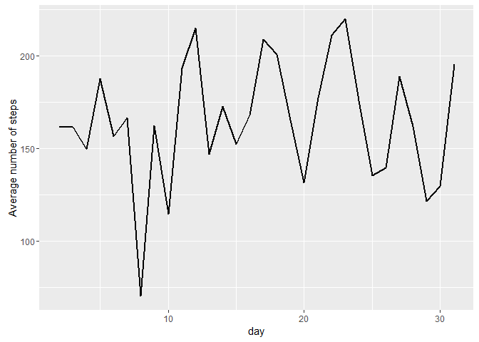
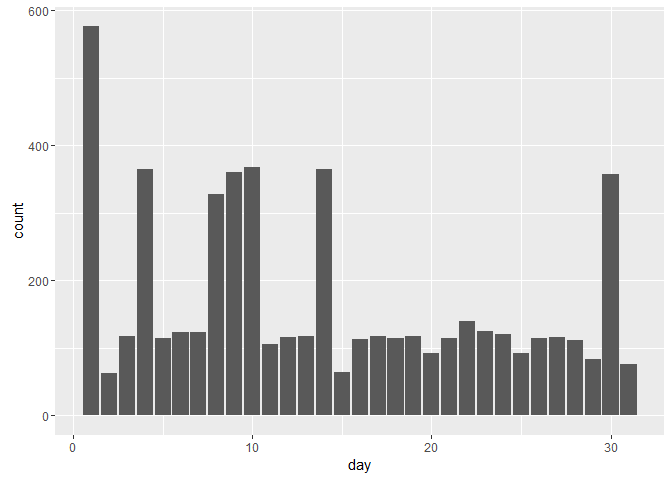
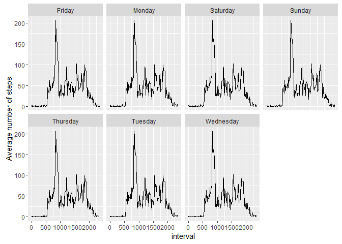

# Week1 Assignment
Kyu Cho  
February 6, 2016  
# Introduction
It is now possible to collect a large amount of data about personal movement using activity monitoring devices such as a Fitbit, Nike Fuelband, or Jawbone Up. These type of devices are part of the "quantified self" movement - a group of enthusiasts who take measurements about themselves regularly to improve their health, to find patterns in their behavior, or because they are tech geeks. But these data remain under-utilized both because the raw data are hard to obtain and there is a lack of statistical methods and software for processing and interpreting the data.

This assignment makes use of data from a personal activity monitoring device. This device collects data at 5 minute intervals through out the day. The data consists of two months of data from an anonymous individual collected during the months of October and November, 2012 and include the number of steps taken in 5 minute intervals each day.

The data for this assignment can be downloaded from the course web site:

# Variables
- steps: Number of steps taking in a 5-minute interval (missing values are coded as NA)
- date: The date on which the measurement was taken in YYYY-MM-DD format
- interval: Identifier for the 5-minute interval in which measurement was taken

```r
library(ggplot2)
library(lubridate) # Time stamp
library(mosaic)
library(caret)
```

## 1) Code for reading in the dataset and/or processing the data

```r
setwd("E:/Google Drive/College/1-Data Science/2-Reproducible Research")
data = read.csv("activity.csv")
summary(data)
```

```
##      steps                date          interval     
##  Min.   :  0.00   2012-10-01:  288   Min.   :   0.0  
##  1st Qu.:  0.00   2012-10-02:  288   1st Qu.: 588.8  
##  Median :  0.00   2012-10-03:  288   Median :1177.5  
##  Mean   : 37.38   2012-10-04:  288   Mean   :1177.5  
##  3rd Qu.: 12.00   2012-10-05:  288   3rd Qu.:1766.2  
##  Max.   :806.00   2012-10-06:  288   Max.   :2355.0  
##  NA's   :2304     (Other)   :15840
```

```r
data$date = as.POSIXct(strptime(data$date, "%Y-%m-%d"))
data$day = day(data$date)
data$weekdays = weekdays(data$date)
str(data)
```

```
## 'data.frame':	17568 obs. of  5 variables:
##  $ steps   : int  NA NA NA NA NA NA NA NA NA NA ...
##  $ date    : POSIXct, format: "2012-10-01" "2012-10-01" ...
##  $ interval: int  0 5 10 15 20 25 30 35 40 45 ...
##  $ day     : int  1 1 1 1 1 1 1 1 1 1 ...
##  $ weekdays: chr  "Monday" "Monday" "Monday" "Monday" ...
```

## 2) Histogram of the total number of steps taken each day

```r
data2 = tally(group_by(data, steps, day))
head(data2)
```

```
## Source: local data frame [6 x 3]
## Groups: steps [1]
## 
##   steps   day     n
##   (int) (int) (int)
## 1     0     2   500
## 2     0     3   405
## 3     0     4   188
## 4     0     5   416
## 5     0     6   387
## 6     0     7   373
```

```r
tail(data2)
```

```
## Source: local data frame [6 x 3]
## Groups: steps [1]
## 
##   steps   day     n
##   (int) (int) (int)
## 1    NA     4   288
## 2    NA     8   288
## 3    NA     9   288
## 4    NA    10   288
## 5    NA    14   288
## 6    NA    30   288
```

```r
ggplot(data2, aes(day)) + geom_bar()
```

\

```r
table(data2$day)
```

```
## 
##   1   2   3   4   5   6   7   8   9  10  11  12  13  14  15  16  17  18 
##   1  63 117  77 115 124 124  40  74  81 105 116 117  77  64 113 117 114 
##  19  20  21  22  23  24  25  26  27  28  29  30  31 
## 117  93 114 140 125 121  93 114 116 111  84  71  76
```

## 3) Mean and median number of steps taken each day

```r
data2 = aggregate(steps~day, data2, mean)
data2$steps = round(data2$steps, digits=2)
data2
```

```
##    day  steps
## 1    2 161.52
## 2    3 161.53
## 3    4 149.71
## 4    5 187.52
## 5    6 156.70
## 6    7 166.63
## 7    8  70.36
## 8    9 162.37
## 9   10 114.49
## 10  11 193.38
## 11  12 214.97
## 12  13 147.11
## 13  14 172.83
## 14  15 152.19
## 15  16 168.15
## 16  17 208.93
## 17  18 200.82
## 18  19 165.20
## 19  20 131.38
## 20  21 177.39
## 21  22 211.01
## 22  23 219.79
## 23  24 175.78
## 24  25 135.45
## 25  26 139.61
## 26  27 188.68
## 27  28 161.95
## 28  29 121.57
## 29  30 129.66
## 30  31 195.28
```

## 4) Time series plot of the average number of steps taken

```r
ggplot(data2, aes(x=day, y=steps)) + 
     geom_line(size=1) +
     ylab("Average number of steps")
```

\

## 5) The 5-minute interval that, on average, contains the maximum number of steps

```r
data2 = aggregate(steps~interval, data, mean)
head(data2)
```

```
##   interval     steps
## 1        0 1.7169811
## 2        5 0.3396226
## 3       10 0.1320755
## 4       15 0.1509434
## 5       20 0.0754717
## 6       25 2.0943396
```

```r
tail(data2)
```

```
##     interval     steps
## 283     2330 2.6037736
## 284     2335 4.6981132
## 285     2340 3.3018868
## 286     2345 0.6415094
## 287     2350 0.2264151
## 288     2355 1.0754717
```

```r
which.max(data2$steps)
```

```
## [1] 104
```

```r
data2[104,]
```

```
##     interval    steps
## 104      835 206.1698
```

## 6) Code to describe and show a strategy for imputing missing data

```r
# Build the regression model to predict the missing value
mdl_lm = lm(steps~day+weekdays+interval, data=data)
pred_lm = predict(mdl_lm, data)

# Write a function that return prediction value if it's missing or ragular value
impute = function (a, a.impute){
     ifelse (is.na(a), a.impute, a)
}
data$steps = impute(data$steps, pred_lm)
summary(data)
```

```
##      steps            date                        interval     
##  Min.   :  0.0   Min.   :2012-10-01 00:00:00   Min.   :   0.0  
##  1st Qu.:  0.0   1st Qu.:2012-10-16 00:00:00   1st Qu.: 588.8  
##  Median :  0.0   Median :2012-10-31 00:00:00   Median :1177.5  
##  Mean   : 37.5   Mean   :2012-10-31 00:25:34   Mean   :1177.5  
##  3rd Qu.: 35.0   3rd Qu.:2012-11-15 00:00:00   3rd Qu.:1766.2  
##  Max.   :806.0   Max.   :2012-11-30 00:00:00   Max.   :2355.0  
##       day          weekdays        
##  Min.   : 1.00   Length:17568      
##  1st Qu.: 8.00   Class :character  
##  Median :16.00   Mode  :character  
##  Mean   :15.75                     
##  3rd Qu.:23.00                     
##  Max.   :31.00
```

## 7) Histogram of the total number of steps taken each day after missing values are impute

```r
data_hist = tally(group_by(data, steps, day))
head(data_hist)
```

```
## Source: local data frame [6 x 3]
## Groups: steps [1]
## 
##   steps   day     n
##   (dbl) (int) (int)
## 1     0     2   500
## 2     0     3   405
## 3     0     4   188
## 4     0     5   416
## 5     0     6   387
## 6     0     7   373
```

```r
tail(data_hist)
```

```
## Source: local data frame [6 x 3]
## Groups: steps [6]
## 
##   steps   day     n
##   (dbl) (int) (int)
## 1   785    24     1
## 2   786    15     1
## 3   789    19     1
## 4   794    27     1
## 5   802    12     1
## 6   806    27     1
```

```r
ggplot(data_hist, aes(day)) + geom_bar()
```

\

```r
table(data_hist$day)
```

```
## 
##   1   2   3   4   5   6   7   8   9  10  11  12  13  14  15  16  17  18 
## 576  63 117 364 115 124 124 327 361 368 105 116 117 364  64 113 117 114 
##  19  20  21  22  23  24  25  26  27  28  29  30  31 
## 117  93 114 140 125 121  93 114 116 111  84 358  76
```


## 8) Panel plot comparing the average number of steps taken per 5-minute interval across weekdays and weekends

```r
data_mrged = merge(data, data2, by=c("interval")) 
colnames(data_mrged)[2] = c("steps")
colnames(data_mrged)[6] = c("avgSteps")
head(data_mrged)
```

```
##   interval   steps       date day weekdays avgSteps
## 1        0 25.3647 2012-10-01   1   Monday 1.716981
## 2        0  0.0000 2012-11-23  23   Friday 1.716981
## 3        0  0.0000 2012-10-28  28   Sunday 1.716981
## 4        0  0.0000 2012-11-06   6  Tuesday 1.716981
## 5        0  0.0000 2012-11-24  24 Saturday 1.716981
## 6        0  0.0000 2012-11-15  15 Thursday 1.716981
```

```r
tail(data_mrged)
```

```
##       interval    steps       date day weekdays avgSteps
## 17563     2355  0.00000 2012-10-16  16  Tuesday 1.075472
## 17564     2355  0.00000 2012-10-07   7   Sunday 1.075472
## 17565     2355  0.00000 2012-10-25  25 Thursday 1.075472
## 17566     2355  0.00000 2012-11-03   3 Saturday 1.075472
## 17567     2355 41.60590 2012-10-08   8   Monday 1.075472
## 17568     2355 52.01911 2012-11-30  30   Friday 1.075472
```

```r
ggplot(data_mrged, aes(x=interval, y=avgSteps)) + 
     geom_line() +
     facet_wrap(~weekdays, nrow=2) +
     ylab("Average number of steps")
```

\

